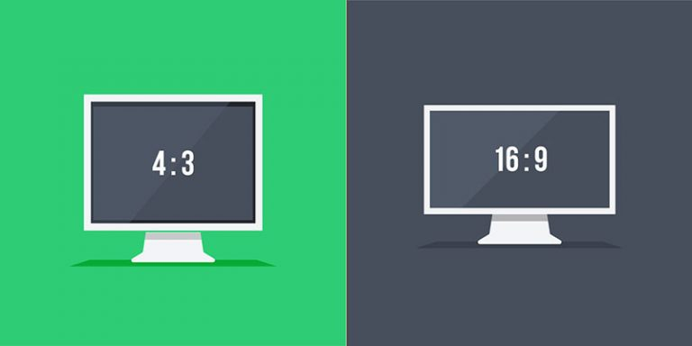

# Vue.js aspect ratio



## 💿 Installation

### Via NPM

```bash
$ npm install v-aspect-ratio --save
```
### Via Yarn

```bash
$ yarn add v-aspect-ratio
```

## Initialization

### As a global plugin

It must be called before new Vue ()

```javascript
import Vue from "vue";
import AspectRatio from "v-aspect-ratio";

Vue.use(AspectRatio);
```

### As a global directive

```javascript
import Vue from "vue";
import AspectRatio from "v-aspect-ration";

Vue.directive("aspect-ratio", AspectRatio.directive)
```

### As a local directive

```javascript
import AspectRatio from "v-aspect-ration";

export default {
  name: "YourAwesomeComponent",
  directives: {
    "aspect-ratio": AspectRatio.directive
  }
}
```

## 🚀 Usage

There's nothing you need to do in JavaScript except for installation. To use the plugin, simply use the v-aspect-ratio directive with the value you need.

```vue
<template>
  <div>
    <div v-aspect-ratio="'16:9'"></div>
    <div v-aspect-ratio="'4:3'"></div>
  </div>
</template>
```

## 💉 Tests
Jest is used for unit-tests.

You can run tests by typing this command in your console:

```bash
npm run test
```

## Powered by

* Babel
* Webpack 4

## 🔒 License

[MIT](http://opensource.org/licenses/MIT)